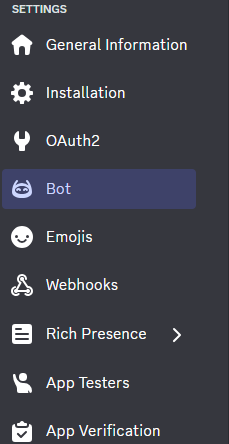
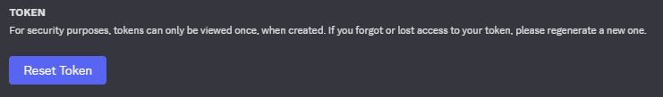
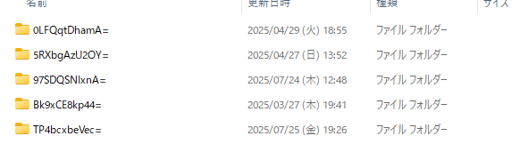
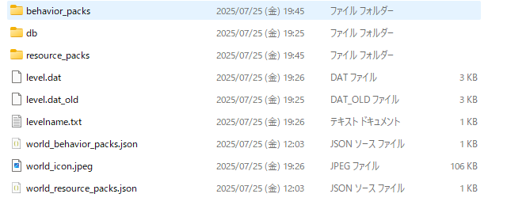

# 🧱 Minecraft Bedrock × Discord Bot 連携ガイド

## ✅ 前提条件

以下の準備が完了していることを確認してください：

* ✅ **Minecraft Bedrock** を購入していること
  　未購入の方はこちらから購入👉 [公式サイト](https://www.minecraft.net/ja-jp/store/minecraft-deluxe-collection-pc?tabs=%7B%22details%22%3A0%7D)

* 🐍 **Python (最新版推奨)** がインストールされていること
  　👉 [公式ダウンロードページ](https://www.python.org/downloads/)

* 🤖 **Discord.py** がインストールされていること（**ver 2.0以上必須**）
  　📦 インストールコマンド：

  ```bash
  pip install discord.py
  ```

* 🪪 **Discordアカウント** を所持していること

* 🔧 **Botを作成済み** であること
  　👉 [Botの作成はこちらから](https://discord.com/developers/applications)

* 🧩 **Botをサーバーに参加させている** こと
* Botに必要な権限一覧
　Send Messages
　Attach Files
　Read Message History
　Use Slash Commands
---

## 🚀 Botの起動手順

1. 🔑 **BotのTOKENを取得**してください
   　
   　

2. `main.py` の `TOKEN` のところに **コピーしたTOKENを貼り付け** ます。

3. 💻 以下のコマンドでBotを起動します：

   ```bash
   python main.pyのパス
   ```

---

## 🎮 Minecraftワールドの準備

> ⚠️ 事前にMinecraftのワールドを **一度閉じて数分待ってから** 以下の手順を進めてください！

1. **Minecraft Bedrockで新しいワールドを作成**してください。

2. 次のフォルダにアクセスします👇

   ```
   C:\Users\Your user name\AppData\Local\Packages\Microsoft.MinecraftUWP_8wekyb3d8bbwe\LocalState\games\com.mojang\minecraftWorlds
   ```

3. フォルダ内にあるたくさんの文字列のフォルダの中から、**さっき作ったワールド**を探します。

### 🔍 見分け方のポイント

* 🕒 **更新日時が最新**のフォルダ
* 📄 フォルダ内の `levelname.txt` の中に **ワールド名** が記載されています
* 🖼️ `world_icon.jpeg` でワールドの見た目を確認できます

　
　

---

## 🛠️ コマンドの使い方

Botが入っているDiscordサーバーで、以下のスラッシュコマンドを使用します。

### `/setup` サーバーをセットアップ！

🔧 各オプションの説明：

| オプション       | 内容                        |
| ----------- | ------------------------- |
| `name`      | ワールドフォルダ名を指定              |
| `overwrite` | 同じアドオンの上書きの可否             |
| `admin`     | 管理者を設定                    |
| `check`     | アドオン追加の許可を管理者が行うかどうか      |
| `add_user`  | `/setup` コマンドを使えるユーザーを追加  |
| `del_user`  | 上記ユーザーを削除                 |
| `timeout`   | 管理者が一定時間内に許可しない場合に自動キャンセル |

---

### `/addon` 任意のアドオンをワールドに追加！

### `/debug` デバッグ情報を表示！

### `/back-up` サーバーのバックアップを送信！

### `/del_addon` ビヘイビアーパックやリソースパックを削除！

※削除対象は `/debug` コマンドで確認できます。

---

📌 **ヒント**

* 最初に必ず `/setup` を実行しておきましょう！
* コマンドの補完機能を活用すれば、入力ミスが減ります。

---

これで、MinecraftとDiscord Botの連携の準備はバッチリです！
不明点があれば、開発者またはサポートまでお問い合わせください。
